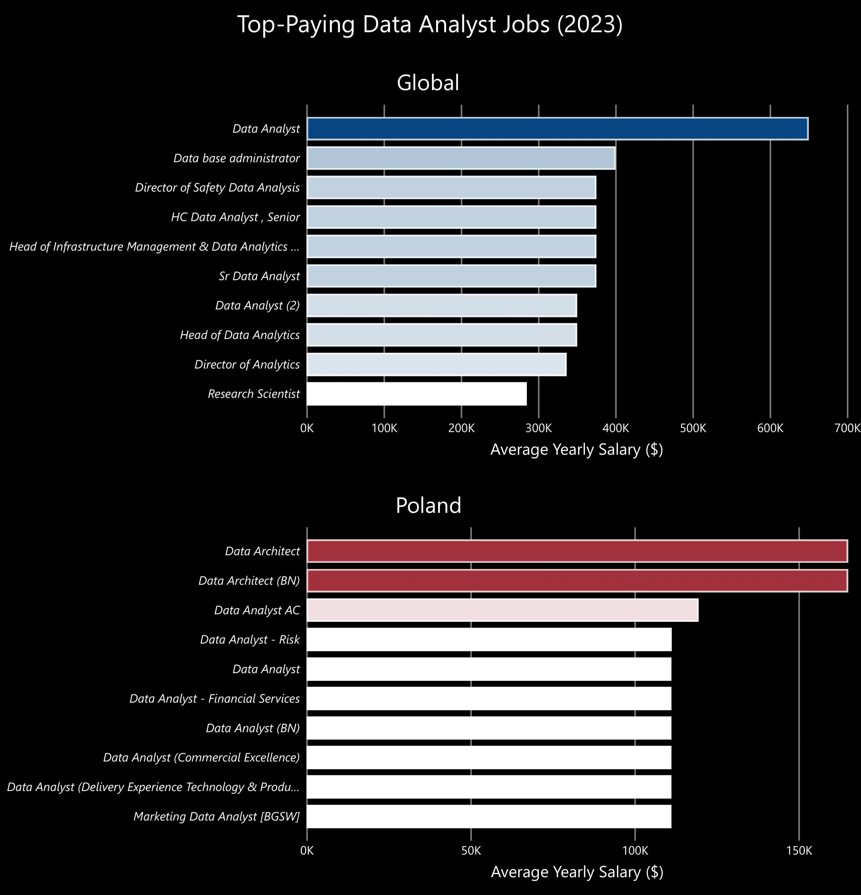
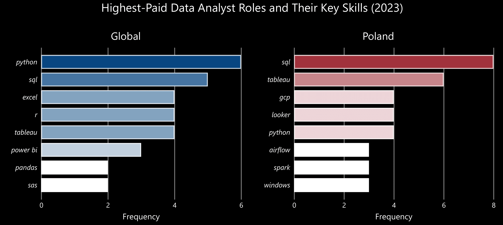
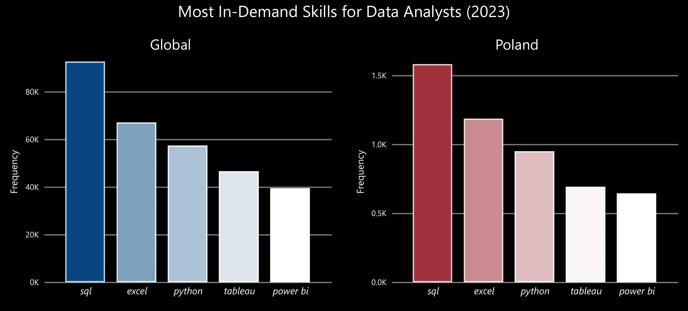
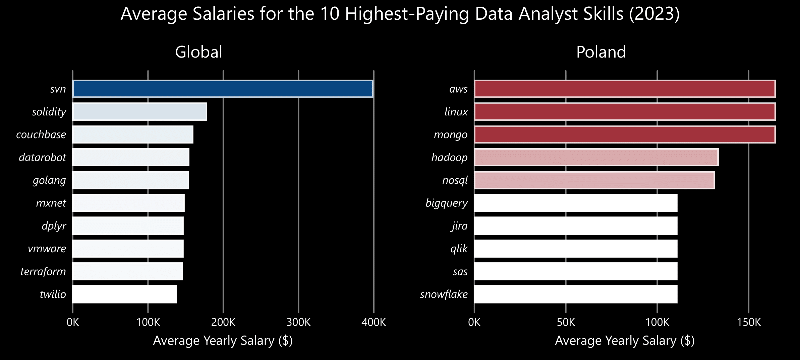
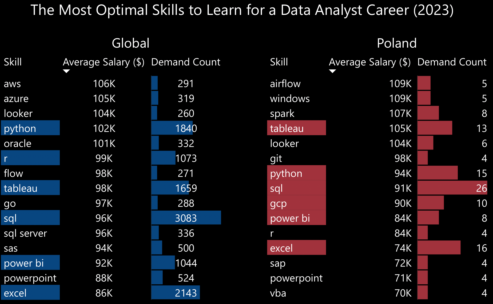
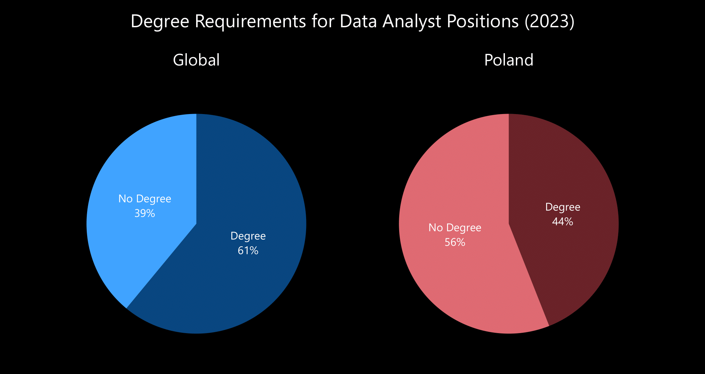
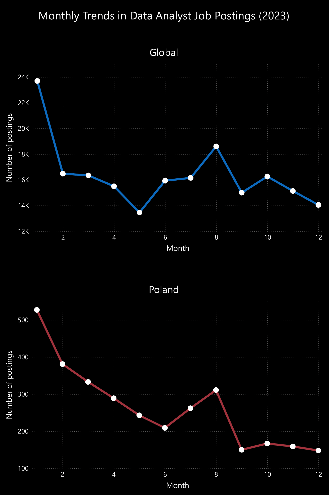

 # Introduction

Welcome to my project, where I showcase my expertise in using **SQL** as a powerful tool for data analysis! 

Special thanks to [Luke Barousse](https://github.com/lukebarousse) and [Kelly Adams](https://github.com/kellyjadams) for developing the [SQL Data Analytics Course](https://www.youtube.com/watch?v=7mz73uXD9DA&t=14011s), which provides aspiring data analysts with a structured and accessible way to master **SQL**.

The dataset used in this project is sourced from the course materials and contains real-world job posting data from 2023. It provides valuable insights into job titles, salaries, locations, essential skills, and other key employment factors.

# Background
This project aims to help aspiring data analysts like myself navigate the job market by providing valuable insights into the global and Polish data analyst job landscape. 

### 🔍 The analysis focuses on data analyst roles, covering:
1. 💰 Highest-paying jobs
2. 🔧 Key skills required for top-paying roles
3. 🔥 Most in-demand skills
4. 💰🔧 Top-paying skills
5. 📚💡 Optimal skills to learn for career growth
6. 🎓 Degree requirements
7. 📅 Months with the highest number of job postings

# Tools Used
To conduct this analysis, I utilized several essential tools:

- **SQL -** the core of my analysis, allowing me to extract meaningful insights from the database.
- **PostgreSQL -** the chosen database management system for handling job posting data.
- **Visual Studio Code -** used for managing the database and executing SQL queries efficiently.
- **Git & GitHub -** essential for version control, sharing SQL scripts, and tracking project progress.
- **Power BI -** used for data visualization, transforming extracted data by SQL into meaningful insights through charts.

🔍 [**SQL queries**](/project_sql/)  
📊 [**Power BI charts**](/assets/)

# The Analysis
Each query in this project was designed to explore key aspects of the data analyst job market, both globally and in Poland. Here’s how I approached each question:

### 1. Top-Paying Data Analyst Jobs
This queries pinpoints the highest-paying data analyst roles 💰, highlighting the most lucrative opportunities in the field.

```sql
--Global--
SELECT
	name AS company_name,
	job_id,
	job_title,
	salary_year_avg,
	job_schedule_type,
	job_posted_date::DATE
FROM
	job_postings_fact
LEFT JOIN 
	company_dim ON job_postings_fact.company_id = company_dim.company_id
WHERE
	job_title_short = 'Data Analyst'
	AND salary_year_avg IS NOT NULL
ORDER BY
	salary_year_avg DESC 
LIMIT 10;
```
```sql
--Poland--
SELECT
	name AS company_name,
	job_id,
	job_title,
	salary_year_avg,
	job_schedule_type,
	job_posted_date::DATE
FROM
	job_postings_fact
LEFT JOIN 
	company_dim ON job_postings_fact.company_id = company_dim.company_id
WHERE
	job_title_short = 'Data Analyst'
	AND salary_year_avg IS NOT NULL
	AND job_country = 'Poland'
ORDER BY
	salary_year_avg DESC 
LIMIT 10;
```

*Bar charts generated in Power BI from my SQL query results, showcasing the top 10 highest-paying data analyst roles in 2023, both worldwide and in Poland, along with their corresponding salaries*

Here's the breakdown of the top data analyst jobs in 2023:

### 2. Skills for Top Paying Jobs
To identify the 🔧 most in-demand skills for the highest-paying jobs 💰 from the previous query, I merged job postings with skills data. This analysis reveals key competencies that employers prioritize for top-paying roles.
```sql
--Global--
WITH top_paying_jobs AS
(
    SELECT
        name AS company_name,
        job_id,
        job_title,
        salary_year_avg
    FROM
        job_postings_fact
    LEFT JOIN
        company_dim ON job_postings_fact.company_id = company_dim.company_id
    WHERE
        job_title_short = 'Data Analyst' 
        AND salary_year_avg IS NOT NULL 
    ORDER BY
        salary_year_avg DESC
    LIMIT
        14
)
SELECT
    top_paying_jobs.*,
    skills
FROM
    top_paying_jobs
INNER JOIN
    skills_job_dim ON top_paying_jobs.job_id = skills_job_dim.job_id
INNER JOIN
    skills_dim ON skills_job_dim.skill_id = skills_dim.skill_id
ORDER BY
    salary_year_avg DESC;
```
```sql
--Poland--
WITH top_paying_jobs AS
(
    SELECT
        name AS company_name,
        job_id,
        job_title,
        salary_year_avg
    FROM
        job_postings_fact
    LEFT JOIN
        company_dim ON job_postings_fact.company_id = company_dim.company_id
    WHERE
        job_title_short = 'Data Analyst' 
        AND salary_year_avg IS NOT NULL 
        AND job_country = 'Poland'
    ORDER BY
        salary_year_avg DESC
    LIMIT
        10
)
SELECT
    top_paying_jobs.*,
    skills
FROM
    top_paying_jobs
INNER JOIN
    skills_job_dim ON top_paying_jobs.job_id = skills_job_dim.job_id
INNER JOIN
    skills_dim ON skills_job_dim.skill_id = skills_dim.skill_id
ORDER BY
    salary_year_avg DESC;
```

*Bar graphs illustrating the count of skills for the top 10 paying jobs for data analysts in 2023, both globally and in Poland*

Here's the breakdown of the most demanded skills for the top 10 highest paying data analyst jobs in 2023:

### 3. In-Demand Skills for Data Analysts
This query revealed the most commonly requested skills in job postings, highlighting key areas of high demand 🔥.
```sql
--Global--
SELECT
    skills,
    COUNT(skills_job_dim.job_id) AS demand_count
FROM 
    job_postings_fact
INNER JOIN 
    skills_job_dim ON job_postings_fact.job_id = skills_job_dim.job_id
INNER JOIN
    skills_dim ON skills_job_dim.skill_id = skills_dim.skill_id
WHERE
    job_title_short = 'Data Analyst'
GROUP BY
    skills
ORDER BY
    demand_count DESC
LIMIT 5;
```
```sql
--Poland--
SELECT
    skills,
    COUNT(skills_job_dim.job_id) AS demand_count
FROM 
    job_postings_fact
INNER JOIN 
    skills_job_dim ON job_postings_fact.job_id = skills_job_dim.job_id
INNER JOIN
    skills_dim ON skills_job_dim.skill_id = skills_dim.skill_id
WHERE
    job_title_short = 'Data Analyst'
    AND job_country = 'Poland'
GROUP BY
    skills
ORDER BY
    demand_count DESC
LIMIT 5;
```

*A chart demonstrating the 5 most in-demand skills in data analyst job postings in 2023, both globally and in Poland.*

Here's the breakdown of the most demanded skills for data analysts in 2023:

### 4. Skills Based on Salary
Analyzing the average salaries associated with various skills revealed which ones offer the highest pay 💰.
```sql
--Global--
SELECT
    skills AS skill,
    ROUND (AVG (salary_year_avg), 0) AS avg_salary
FROM 
    job_postings_fact
INNER JOIN 
    skills_job_dim ON job_postings_fact.job_id = skills_job_dim.job_id
INNER JOIN 
    skills_dim ON skills_job_dim.skill_id = skills_dim.skill_id
WHERE
    job_title_short = 'Data Analyst'
    AND salary_year_avg IS NOT NULL
GROUP BY
    skill
ORDER BY
    avg_salary DESC
LIMIT 10;
```
```sql
--Poland--
SELECT
    skills AS skill,
    ROUND (AVG (salary_year_avg), 0) AS avg_salary
FROM 
    job_postings_fact
INNER JOIN 
    skills_job_dim ON job_postings_fact.job_id = skills_job_dim.job_id
INNER JOIN 
    skills_dim ON skills_job_dim.skill_id = skills_dim.skill_id
WHERE
    job_title_short = 'Data Analyst'
    AND salary_year_avg IS NOT NULL
    AND job_country = 'Poland'
GROUP BY
    skill
ORDER BY
    avg_salary DESC
LIMIT 10;
```

*Charts of the average salary for the top 10 paying skills for data analysts*

Here's a breakdown of the results for top paying skills for Data Analysts:

### 5. Most Optimal Skills to Learn

By combining demand and salary insights, this query aimed to identify skills that are both highly sought after 🔥 and well-paid 💰, offering a strategic focus for skill development.

```sql
--Global--
WITH
    skills_demand AS (
        SELECT
            skills_dim.skill_id,
            skills_dim.skills,
            COUNT(skills_job_dim.job_id) AS demand_count
        FROM 
            job_postings_fact
            INNER JOIN 
                skills_job_dim ON job_postings_fact.job_id = skills_job_dim.job_id
            INNER JOIN
                skills_dim ON skills_job_dim.skill_id = skills_dim.skill_id
        WHERE
            job_postings_fact.job_title_short = 'Data Analyst' 
            AND job_postings_fact.salary_year_avg IS NOT NULL 
        GROUP BY
            skills_dim.skill_id
),
    average_salary AS (
        SELECT
            skills_job_dim.skill_id,
            AVG (job_postings_fact.salary_year_avg) AS avg_salary
        FROM 
            job_postings_fact
        INNER JOIN 
            skills_job_dim ON job_postings_fact.job_id = skills_job_dim.job_id
        WHERE
            job_postings_fact.job_title_short = 'Data Analyst' 
            AND job_postings_fact.salary_year_avg IS NOT NULL 
        GROUP BY
            skills_job_dim.skill_id
)
SELECT
    DISTINCT(skills_demand.skills),
    skills_demand.demand_count,
    ROUND(average_salary.avg_salary, 0) AS avg_salary
FROM
    skills_demand
INNER JOIN
    average_salary ON skills_demand.skill_id = average_salary.skill_id
WHERE
    demand_count > 250
ORDER BY
    avg_salary DESC,
    demand_count DESC
LIMIT 10;
```
```sql
--Poland--
WITH
    skills_demand AS (
        SELECT
            skills_dim.skill_id,
            skills_dim.skills,
            COUNT(skills_job_dim.job_id) AS demand_count
        FROM 
            job_postings_fact
            INNER JOIN 
                skills_job_dim ON job_postings_fact.job_id = skills_job_dim.job_id
            INNER JOIN
                skills_dim ON skills_job_dim.skill_id = skills_dim.skill_id
        WHERE
            job_postings_fact.job_title_short = 'Data Analyst' AND
            job_postings_fact.salary_year_avg IS NOT NULL AND
            job_postings_fact.job_country = 'Poland'
        GROUP BY
            skills_dim.skill_id
),
    average_salary AS (
        SELECT
            skills_job_dim.skill_id,
            AVG (job_postings_fact.salary_year_avg) AS avg_salary
        FROM 
            job_postings_fact
        INNER JOIN 
            skills_job_dim ON job_postings_fact.job_id = skills_job_dim.job_id
        WHERE
            job_postings_fact.job_title_short = 'Data Analyst' AND
            job_postings_fact.salary_year_avg IS NOT NULL AND
            job_postings_fact.job_country = 'Poland'
        GROUP BY
            skills_job_dim.skill_id
)
SELECT
    skills_demand.skills,
    skills_demand.demand_count,
    ROUND(average_salary.avg_salary, 0) AS avg_salary
FROM
    skills_demand
INNER JOIN
    average_salary ON skills_demand.skill_id = average_salary.skill_id
WHERE
    demand_count > 2
ORDER BY
    avg_salary DESC,
    demand_count DESC
LIMIT 10;
```

*Table of the most optimal skills for data analyst sorted by salary*

Here's a breakdown of the most optimal skills for Data Analysts in 2023: 

### 6. Is a degree required for data analyst roles?

This query helps aspiring data analysts navigate the job market by calculating the percentage of job postings that don’t require a degree 🎓. This insight assists job seekers in deciding whether to pursue a degree or focus on self-learning to develop practical skills 🧠.
```sql
--Global--
SELECT 
    ROUND(COUNT(CASE WHEN job_no_degree_mention = FALSE THEN 1 END) * 100.0 / COUNT(*), 0) AS degree,
    ROUND(COUNT(CASE WHEN job_no_degree_mention = TRUE THEN 1 END) * 100.0 / COUNT(*), 0) AS no_degree
FROM 
    job_postings_fact
WHERE 
    job_title_short = 'Data Analyst';
```
```sql
--Poland--
SELECT 
    ROUND(COUNT(CASE WHEN job_no_degree_mention = FALSE THEN 1 END) * 100.0 / COUNT(*), 0) AS degree,
    ROUND(COUNT(CASE WHEN job_no_degree_mention = TRUE THEN 1 END) * 100.0 / COUNT(*), 0) AS no_degree
FROM 
    job_postings_fact
WHERE 
    job_title_short = 'Data Analyst'
    AND job_country = 'Poland';
```

*Pie chart showing the percentage of Data Analyst job postings that do not require a degree*

### 6. When are data analyst job postings most frequent?

```sql
--Global--
SELECT 
    EXTRACT(MONTH FROM job_posted_date) AS month,
    COUNT(job_id) AS number_of_postings_global
FROM 
    job_postings_fact
WHERE 
    job_title_short = 'Data Analyst'
GROUP BY 
    month
ORDER BY
    month;
```
```sql
--Poland--
SELECT 
    EXTRACT(MONTH FROM job_posted_date) AS month,
    COUNT(job_id) AS number_of_postings_Poland
FROM 
    job_postings_fact
WHERE 
    job_title_short = 'Data Analyst'
    AND job_country = 'Poland'
GROUP BY 
    month
ORDER BY
    month;
```

*Charts showing monthly job postings for data analysts in 2023 globally and in Poland*
# What I Learned

Throughout this project, I’ve learned SQL-related skills including:

- **🧩 Complex Query Crafting:** joining tables, using subqueries and wielding WITH clauses for temporary table maneuvers.
- **📊 Data Aggregation:** making aggregate functions like COUNT() and AVG() and using them by GROUP BY.
- **💡 Analytical Wizardry:** Sharpened my ability to tackle real-world challenges, transforming complex questions into insightful SQL queries.

# Conclusions

### Insights
From the analysis, several general insights emerged:

1. **Top-Paying Data Analyst Jobs**: The highest-paying jobs for data analysts that allow remote work offer a wide range of salaries, the highest at $650,000!
2. **Skills for Top-Paying Jobs**: High-paying data analyst jobs require advanced proficiency in SQL, suggesting it’s a critical skill for earning a top salary.
3. **Most In-Demand Skills**: SQL is also the most demanded skill in the data analyst job market, thus making it essential for job seekers.
4. **Skills with Higher Salaries**: Specialized skills, such as SVN and Solidity, are associated with the highest average salaries, indicating a premium on niche expertise.
5. **Optimal Skills for Job Market Value**: SQL leads in demand and offers for a high average salary, positioning it as one of the most optimal skills for data analysts to learn to maximize their market value.

### Closing Thoughts

This project enhanced my SQL skills and provided valuable insights into the data analyst job market. The findings from the analysis serve as a guide to prioritizing skill development and job search efforts. Aspiring data analysts can better position themselves in a competitive job market by focusing on high-demand, high-salary skills. This exploration highlights the importance of continuous learning and adaptation to emerging trends in the field of data analytics.