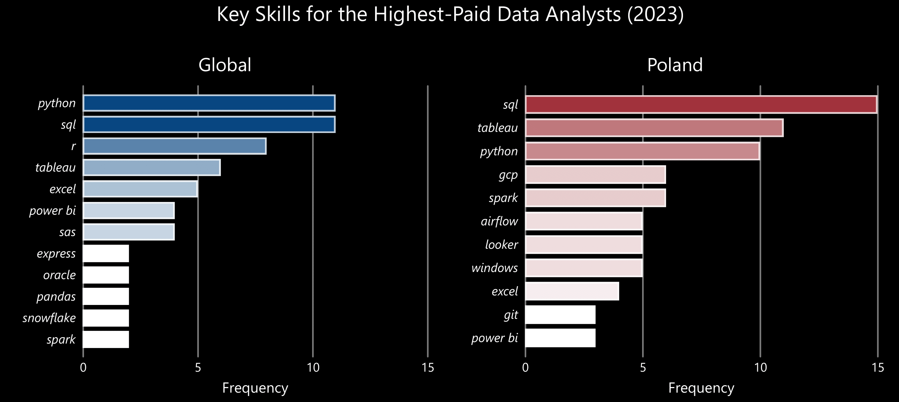
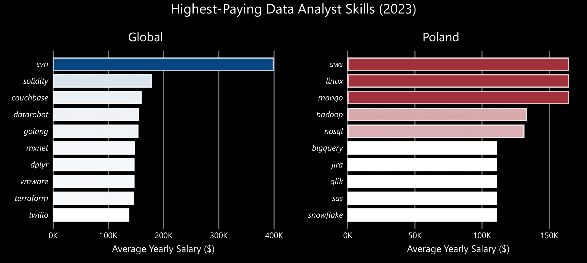

 # Introduction

Welcome to my project, where I showcase my expertise in using **SQL** as a powerful tool for data analysis! 

Special thanks to [Luke Barousse](https://github.com/lukebarousse) and [Kelly Adams](https://github.com/kellyjadams) for developing the [SQL Data Analytics Course](https://www.youtube.com/watch?v=7mz73uXD9DA&t=14011s), which provides aspiring data analysts with a structured and accessible way to master **SQL**.

The dataset used in this project is sourced from the course materials and contains real-world job posting data from 2023. It provides valuable insights into job titles, salaries, locations, essential skills, and other key employment factors.

# Background
This project aims to help aspiring data analysts like myself navigate the job market by providing valuable insights into the global and Polish data analyst job landscape. 

### 🔍 The analysis focuses on data analyst roles, covering:
1. Top-Paying Jobs 💰
2. Skills for Top-Paying Jobs 🔧
3. Most In-Demand Skills 🔥
4. Top-paying skills 💰🔧
5. Most Optimal Skills to Learn 📚💡
6. Degree requirements 🎓
7. Peak Hiring Months 📅📈

# Tools Used
To conduct this analysis, I utilized several essential tools:

- **SQL -** the core of my analysis, allowing me to extract meaningful insights from the database.
- **PostgreSQL -** the chosen database management system for handling job posting data.
- **Visual Studio Code -** used for managing the database and executing SQL queries efficiently.
- **Git & GitHub -** essential for version control, sharing SQL scripts, and tracking project progress.
- **Power BI -** used for data visualization, transforming extracted data by SQL into meaningful insights through charts.
- **ChatGPT (Plus Subscription)** - assisted me in deriving data-driven insights and crafting clear, concise summaries.

🔍 [**SQL queries**](/project_sql/)  
📊 [**Power BI charts**](/assets/)

# The Analysis
Each query in this project was designed to explore key aspects of the data analyst job market in 2023, both globally and in Poland. Here’s how I approached each question:

### 1. Top-Paying Jobs 💰
This queries pinpoints the highest-paying data analyst roles, highlighting the most lucrative opportunities in the field.

```sql
--Global--
SELECT
	name AS company_name,
	job_id,
	job_title,
	salary_year_avg,
	job_schedule_type,
	job_posted_date::DATE
FROM
	job_postings_fact
LEFT JOIN 
	company_dim ON job_postings_fact.company_id = company_dim.company_id
WHERE
	job_title_short = 'Data Analyst'
	AND salary_year_avg IS NOT NULL
ORDER BY
	salary_year_avg DESC 
LIMIT 10;
```
```sql
--Poland--
SELECT
	name AS company_name,
	job_id,
	job_title,
	salary_year_avg,
	job_schedule_type,
	job_posted_date::DATE
FROM
	job_postings_fact
LEFT JOIN 
	company_dim ON job_postings_fact.company_id = company_dim.company_id
WHERE
	job_title_short = 'Data Analyst'
	AND salary_year_avg IS NOT NULL
	AND job_country = 'Poland'
ORDER BY
	salary_year_avg DESC 
LIMIT 10;
```
**Key Takeways**

**Global Market**:
- **Salary Range**: Data Analyst salaries fall between $285K and $400K, with Mantys offering an exceptional $650K.
- **Job Titles**: There's a wide range—from standard Data Analyst roles to specialized and leadership positions like Director of Safety Data Analysis and Head of Data Analytics.
- **Key Companies**: Dominated by tech/AI leaders (Meta, Anthropic, OpenAI, Torc Robotics) and high-profile finance/security firms (Citigroup, Illuminate Mission Solutions). Leadership roles naturally command higher pay, and startups like Mantys are willing to offer premium salaries to attract top talent.

**Polish Market**:
- **Salary Range**: Salaries are more modest, with Data Architect roles at around $165K—roughly 50% higher than the more common Data Analyst roles, which typically hover around $111K.
- **Job Titles**: The market offers a mix of general and specialized roles, including Data Architect, Marketing Data Analyst, and Data Analyst – Risk.
- **Key Companies**: Recurrent postings from companies such as Alter Solutions, Allegro, Bosch Group, and SumUp highlight steady demand across various sectors.

**Comparison**:
- **Compensation**: Global salaries are significantly higher with a broader range and more opportunities at the leadership level, while the Polish market maintains a consistent, modest pay scale.
- **Role Specialization**: Globally, there's a pronounced emphasis on high-level leadership and tech/AI innovation, whereas the Polish market focuses on specialization within traditional sectors, balancing between strategic roles (Data Architect) and general data analytics positions.


*Bar charts generated in Power BI from my SQL query results, showcasing the top 10 highest-paying data analyst roles in 2023, both worldwide and in Poland, along with their corresponding salaries.*

### 2. Skills for Top-Paying Jobs 🔧
To identify the most in-demand skills for the highest-paying jobs, I merged job postings with skills data and expand the limit of top-paying jobs to 20 to dive deeper into the market. This analysis reveals key competencies that employers prioritize for top-paying roles.
```sql
--Global--
WITH top_paying_jobs AS
(
    SELECT
        name AS company_name,
        job_id,
        job_title,
        salary_year_avg
    FROM
        job_postings_fact
    LEFT JOIN
        company_dim ON job_postings_fact.company_id = company_dim.company_id
    WHERE
        job_title_short = 'Data Analyst' 
        AND salary_year_avg IS NOT NULL 
    ORDER BY
        salary_year_avg DESC
    LIMIT
        20
)
SELECT
    top_paying_jobs.*,
    skills
FROM
    top_paying_jobs
INNER JOIN
    skills_job_dim ON top_paying_jobs.job_id = skills_job_dim.job_id
INNER JOIN
    skills_dim ON skills_job_dim.skill_id = skills_dim.skill_id
ORDER BY
    salary_year_avg DESC;
```
```sql
--Poland--
WITH top_paying_jobs AS
(
    SELECT
        name AS company_name,
        job_id,
        job_title,
        salary_year_avg
    FROM
        job_postings_fact
    LEFT JOIN
        company_dim ON job_postings_fact.company_id = company_dim.company_id
    WHERE
        job_title_short = 'Data Analyst' 
        AND salary_year_avg IS NOT NULL 
        AND job_country = 'Poland'
    ORDER BY
        salary_year_avg DESC
    LIMIT
        20
)
SELECT
    top_paying_jobs.*,
    skills
FROM
    top_paying_jobs
INNER JOIN
    skills_job_dim ON top_paying_jobs.job_id = skills_job_dim.job_id
INNER JOIN
    skills_dim ON skills_job_dim.skill_id = skills_dim.skill_id
ORDER BY
    salary_year_avg DESC;
```
**Key Takeways**

- **SQL**, **Python**, and **Tableau** are the top skills in both the global and Polish data analytics markets.
- Poland places a stronger emphasis on big data and cloud technologies (**GCP**, **Spark**, **Airflow**), whereas globally, traditional analytics tools (**R**, **SAS**, **Power BI**) remain key for high-paying roles.
- **Excel** continues to hold value in both markets, highlighting the ongoing relevance of spreadsheet skills despite the rise of advanced analytics tools.



*Bar charts generated in Power BI from my SQL query results, illustrating the count of the most important skills for the top 20 paying jobs for data analysts in 2023, both globally and in Poland.*

### 3. Most In-Demand Skills 🔥
This query revealed the most commonly requested skills in job postings, highlighting key areas of high demand.
```sql
--Global--
SELECT
    skills,
    COUNT(skills_job_dim.job_id) AS demand_count
FROM 
    job_postings_fact
INNER JOIN 
    skills_job_dim ON job_postings_fact.job_id = skills_job_dim.job_id
INNER JOIN
    skills_dim ON skills_job_dim.skill_id = skills_dim.skill_id
WHERE
    job_title_short = 'Data Analyst'
GROUP BY
    skills
ORDER BY
    demand_count DESC
LIMIT 5;
```
```sql
--Poland--
SELECT
    skills,
    COUNT(skills_job_dim.job_id) AS demand_count
FROM 
    job_postings_fact
INNER JOIN 
    skills_job_dim ON job_postings_fact.job_id = skills_job_dim.job_id
INNER JOIN
    skills_dim ON skills_job_dim.skill_id = skills_dim.skill_id
WHERE
    job_title_short = 'Data Analyst'
    AND job_country = 'Poland'
GROUP BY
    skills
ORDER BY
    demand_count DESC
LIMIT 5;
```
**Key Takeways**

- **SQL** and **Excel** remain fundamental, emphasizing the need for strong foundational skills in data processing and spreadsheet manipulation.
- Programming and Visualization Tools like **Python**, **Tableau**, and **Power BI** are essential, pointing towards the increasing importance of technical skills in data storytelling and decision support.


*Bar charts generated in Power BI from my SQL query results, demonstrating the 5 most in-demand skills in data analyst job postings in 2023, both globally and in Poland.*

### 4. Top-paying skills 💰🔧
Analyzing the average salaries associated with various skills revealed which ones offer the highest pay.
```sql
--Global--
SELECT
    skills AS skill,
    ROUND (AVG (salary_year_avg), 0) AS avg_salary
FROM 
    job_postings_fact
INNER JOIN 
    skills_job_dim ON job_postings_fact.job_id = skills_job_dim.job_id
INNER JOIN 
    skills_dim ON skills_job_dim.skill_id = skills_dim.skill_id
WHERE
    job_title_short = 'Data Analyst'
    AND salary_year_avg IS NOT NULL
GROUP BY
    skill
ORDER BY
    avg_salary DESC
LIMIT 10;
```
```sql
--Poland--
SELECT
    skills AS skill,
    ROUND (AVG (salary_year_avg), 0) AS avg_salary
FROM 
    job_postings_fact
INNER JOIN 
    skills_job_dim ON job_postings_fact.job_id = skills_job_dim.job_id
INNER JOIN 
    skills_dim ON skills_job_dim.skill_id = skills_dim.skill_id
WHERE
    job_title_short = 'Data Analyst'
    AND salary_year_avg IS NOT NULL
    AND job_country = 'Poland'
GROUP BY
    skill
ORDER BY
    avg_salary DESC
LIMIT 10;
```
**Key Takeways**

- **Niche Technologies Dominate Globally**: The highest salaries are tied to specialized and emerging skills like **SVN** ($400K), **Solidity** ($179K), and **Couchbase** ($161K), indicating a strong demand for cutting-edge technologies in the global market.
- **Cloud & Database Expertise in Poland**: In Poland, **MongoDB**, **Linux**, and **AWS** lead the top-paying skills, each offering $165K, emphasizing the importance of cloud computing and database management in the local job market.
- **Big Data vs. Emerging Tech**: The global market rewards niche and emerging technologies, while Poland prioritizes cloud infrastructure and big data skills like **Hadoop** ($134K) and **NoSQL** ($132K) for high salaries.
- **Salary Trends**: While global salaries can skyrocket for specialized tech, Poland's highest-paying skills remain within the $165K range, showing a more balanced distribution across in-demand technologies.


*Bar charts generated in Power BI from my SQL query results, presenting the average salary for the top 10 paying skills for data analysts job postings in 2023, both globally and in Poland.*

### 5. Most Optimal Skills to Learn 📚💡

By combining demand and salary insights, this query aimed to identify skills that are both highly sought after 🔥 and well-paid 💰, offering a strategic focus for skill development.

```sql
--Global--
WITH
    skills_demand AS (
        SELECT
            skills_dim.skill_id,
            skills_dim.skills,
            COUNT(skills_job_dim.job_id) AS demand_count
        FROM 
            job_postings_fact
            INNER JOIN 
                skills_job_dim ON job_postings_fact.job_id = skills_job_dim.job_id
            INNER JOIN
                skills_dim ON skills_job_dim.skill_id = skills_dim.skill_id
        WHERE
            job_postings_fact.job_title_short = 'Data Analyst' 
            AND job_postings_fact.salary_year_avg IS NOT NULL 
        GROUP BY
            skills_dim.skill_id
),
    average_salary AS (
        SELECT
            skills_job_dim.skill_id,
            AVG (job_postings_fact.salary_year_avg) AS avg_salary
        FROM 
            job_postings_fact
        INNER JOIN 
            skills_job_dim ON job_postings_fact.job_id = skills_job_dim.job_id
        WHERE
            job_postings_fact.job_title_short = 'Data Analyst' 
            AND job_postings_fact.salary_year_avg IS NOT NULL 
        GROUP BY
            skills_job_dim.skill_id
)
SELECT
    DISTINCT(skills_demand.skills),
    skills_demand.demand_count,
    ROUND(average_salary.avg_salary, 0) AS avg_salary
FROM
    skills_demand
INNER JOIN
    average_salary ON skills_demand.skill_id = average_salary.skill_id
WHERE
    demand_count > 250
ORDER BY
    avg_salary DESC,
    demand_count DESC
LIMIT 15;
```
```sql
--Poland--
WITH
    skills_demand AS (
        SELECT
            skills_dim.skill_id,
            skills_dim.skills,
            COUNT(skills_job_dim.job_id) AS demand_count
        FROM 
            job_postings_fact
            INNER JOIN 
                skills_job_dim ON job_postings_fact.job_id = skills_job_dim.job_id
            INNER JOIN
                skills_dim ON skills_job_dim.skill_id = skills_dim.skill_id
        WHERE
            job_postings_fact.job_title_short = 'Data Analyst' AND
            job_postings_fact.salary_year_avg IS NOT NULL AND
            job_postings_fact.job_country = 'Poland'
        GROUP BY
            skills_dim.skill_id
),
    average_salary AS (
        SELECT
            skills_job_dim.skill_id,
            AVG (job_postings_fact.salary_year_avg) AS avg_salary
        FROM 
            job_postings_fact
        INNER JOIN 
            skills_job_dim ON job_postings_fact.job_id = skills_job_dim.job_id
        WHERE
            job_postings_fact.job_title_short = 'Data Analyst' AND
            job_postings_fact.salary_year_avg IS NOT NULL AND
            job_postings_fact.job_country = 'Poland'
        GROUP BY
            skills_job_dim.skill_id
)
SELECT
    skills_demand.skills,
    skills_demand.demand_count,
    ROUND(average_salary.avg_salary, 0) AS avg_salary
FROM
    skills_demand
INNER JOIN
    average_salary ON skills_demand.skill_id = average_salary.skill_id
WHERE
    demand_count > 4
ORDER BY
    avg_salary DESC,
    demand_count DESC
LIMIT 15;
```
**Key Takeways**

- **SQL** & **Python** dominate demand but don’t command the highest salaries.
- **AWS** and **Azure** lead globally, while in Poland, **Airflow**, **Windows**, **GCP**, and **Spark** highlight the growing demand for cloud-based infrastructure, workflow automation & big data processing.
- BI tools **Tableau** and **Looker** remain highly valuable, while **Power BI** is widely used but tends to offer slightly lower salaries.
- **R** remains important globally but has lower demand in Poland, suggesting a regional shift toward Python-based analytics.
- **Excel** remains widely used but pays less, confirming its role as a fundamental skill rather than a high-paying specialty.


*Table generated in Power BI from my SQL query results, demonstrating the most optimal skills to learn for data analyst sorted by salary, both globally and in Poland.*

### 6. Degree requirements 🎓

This analysis helps aspiring data analysts understand the job market by determining the proportion of job postings that don’t require a degree 🎓. It provides valuable insight for job seekers, guiding them on whether to invest in formal education or prioritize self-learning to build practical skills 🧠.
```sql
--Global--
SELECT 
    ROUND(COUNT(CASE WHEN job_no_degree_mention = FALSE THEN 1 END) * 100.0 / COUNT(*), 0) AS degree,
    ROUND(COUNT(CASE WHEN job_no_degree_mention = TRUE THEN 1 END) * 100.0 / COUNT(*), 0) AS no_degree
FROM 
    job_postings_fact
WHERE 
    job_title_short = 'Data Analyst';
```
```sql
--Poland--
SELECT 
    ROUND(COUNT(CASE WHEN job_no_degree_mention = FALSE THEN 1 END) * 100.0 / COUNT(*), 0) AS degree,
    ROUND(COUNT(CASE WHEN job_no_degree_mention = TRUE THEN 1 END) * 100.0 / COUNT(*), 0) AS no_degree
FROM 
    job_postings_fact
WHERE 
    job_title_short = 'Data Analyst'
    AND job_country = 'Poland';
```
**Key Takeways**

- **Global Market**: While **39%** of data analyst roles globally do not explicitly require a degree, this doesn’t necessarily mean employers don’t value formal education. A degree is still mentioned in **61%** of job postings, indicating it remains a key qualification for many roles.
- **Polish Market**: **56%** of job postings do not list a degree as a requirement, suggesting a more skills-based hiring approach. However, **44%** of positions still specify a degree, meaning formal education can still be a competitive advantage.
- **Conclusions**: Opportunities exist for candidates without degrees, especially in Poland, where practical experience and certifications may carry more weight. However, a degree can still improve job prospects, particularly in companies that value traditional education. Even when not explicitly stated, employers may still favor candidates with formal academic backgrounds.


*Pie chart created in Power BI from my SQL query results, showing the percentage of Data Analyst job postings that do require/not require a degree*

### 7. Peak Hiring Months 📅📈

This analysis identifies peak periods 📅 for data analyst job postings, enabling job seekers to strategically time their applications for the best opportunities.

```sql
--Global--
SELECT 
    EXTRACT(MONTH FROM job_posted_date) AS month,
    COUNT(job_id) AS number_of_postings_global
FROM 
    job_postings_fact
WHERE 
    job_title_short = 'Data Analyst'
GROUP BY 
    month
ORDER BY
    month;
```
```sql
--Poland--
SELECT 
    EXTRACT(MONTH FROM job_posted_date) AS month,
    COUNT(job_id) AS number_of_postings_Poland
FROM 
    job_postings_fact
WHERE 
    job_title_short = 'Data Analyst'
    AND job_country = 'Poland'
GROUP BY 
    month
ORDER BY
    month;
```
**Key Takeways**

- **January** sees the highest number of job postings as companies ramp up hiring in the new year.
- Hiring slows mid-year (May globally, June in Poland), followed by a secondary increase in **August** as recruitment rebounds after the summer slowdown.
- Hiring activity gradually declines toward the end of the year (September–December), reflecting a typical slowdown in recruitment due to holidays and year-end budget cycles.
- **Conclusion:** Job seekers are most likely to find opportunities at the beginning of the year, with a smaller hiring wave in late summer.


*Plot Charts generated in Power BI from my SQL query results, revealing monthly job postings for data analysts in 2023 globally and in Poland*

# What I Learned

- **🧩 Advanced Query Building:** Honed my ability to craft complex SQL queries, utilizing subqueries, seamlessly joining tables with JOIN, and leveraging WITH clauses for efficient temporary table management.
- **📊 Data Aggregation:** Gained familiarity with GROUP BY, using aggregate functions like COUNT() and AVG() to extract meaningful insights from large datasets.
- **💡 Analytical Problem-Solving:** Sharpened my ability to translate real-world questions into insightful SQL queries, transforming raw data into actionable intelligence.
- **📈 Power BI Visualization:** Enhanced my data storytelling skills by creating compelling visualizations in Power BI, turning numbers into clear, impactful charts.

# Conclusions

### Insights
From the analysis, several key insights about data analyst jobs emerged:

**Top-Paying Jobs 💰**

- **Global**: Salaries typically range from $285K to $400K, with exceptions like startups (e.g., Mantys – $600K). High salaries are driven by expertise in leadership, tech/AI innovation, finance, and security.
- **Poland**: Salaries mostly hover around $111K, with Data Architect roles reaching $165K. The market emphasizes specialization within traditional sectors rather than emerging tech.

**Skills for Top-Paying Jobs 🔧**

- **SQL**, **Python**, and **Tableau** are the most crucial skills for securing the highest-paid roles in both the global and Polish data analytics markets.

**Most In-Demand Skills 🔥**

- The Top 5 most essential skills across the data analytics job market, both globally and in Poland, are **SQL**, **Excel**, **Python**, **Tableau**, and **Power BI**.

**Top-paying skills 💰🔧**

- **Global**: Niche technologies such as **SVN**, **Solidity**, and **Couchbase** command the highest salaries.
- **Poland**: Cloud & Database skills like **MongoDB** and **AWS** lead the top-paying skill set.

**Most Optimal Skills to Learn 📚💡**

- **SQL**, **Python**, **Excel**, **Tableau**, and **Power BI** may not command the highest salaries, but their strong demand makes them fundamental for most data analysts.
- **R** can be a valuable addition to a core skill set, offering competitive salaries and high demand in the global market.
- High-paying and in-demand skills related to cloud-based infrastructure, workflow automation, and big data processing (e.g., **AWS**, **Azure**, **Airflow**, **Windows**, **GCP**, and **Spark**) present strong learning opportunities for career growth.

**Degree requirements 🎓**

- **Global:** 39% of job postings do not explicitly mention a degree requirement, but one may still be expected.
- **Poland:** 56% of job postings do not specify a degree requirement, though it may still be necessary.

**Peak Hiring Months 📅📈**

- **Global & Poland:** The highest number of job postings occur in **January** and **August**, with a slowdown in the middle and end of the year.

### Closing Thoughts

This project significantly enhanced my SQL, Power BI, and AI skills while providing valuable insights into the data analyst job market, both globally and in Poland. The findings serve as a practical guide for prioritizing skill development and optimizing job search strategies.

For aspiring data analysts, focusing on high-demand and high-paying skills can provide a competitive edge in the industry. This exploration highlights the importance of continuous learning, adaptability, and staying updated on emerging trends, tools, and technologies in data analytics.